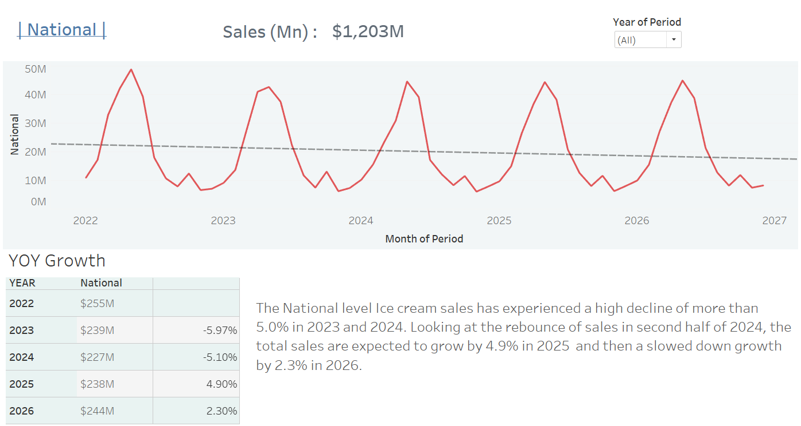
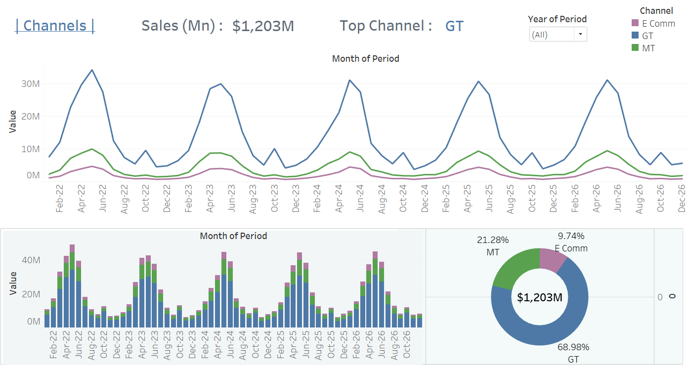
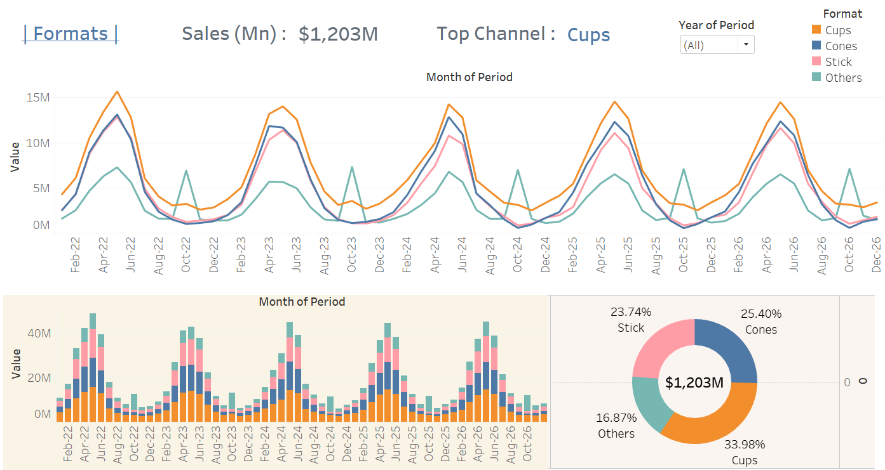

# Multi-Level Sales Dashboard

This project visualizes multi-level Ice cream sales in the country using Tableau, covering national, channel, and format-level views to uncover key trends and insights.  

## 📚 Context

In our work, we present and share predicted results with clients primarily through PowerPoint presentations or Excel reports, as these formats are widely accepted and easily understood by our audience. For this project, I wanted to experiment with creating a similar storytelling experience using Tableau. The goal was to see if Tableau's interactive capabilities could make insights more engaging while still maintaining the clarity and structure that clients are familiar with.  

## 🛠 Data Source
- 5-year time series sales data which consists of **3 years actual + 2 years predicted sales** (sample data).

## 📈 Dashboard Features
- National-Level Sales Overview
- Channel-Level Sales Performance (Online and Retail)
- Format-Level Analysis (Small format vs Large format)
- Monthly and Yearly Sales Trends  

## 📂 Project Structure  
/multi-level-sales-dashboard  
├── README.md  
├── data/ sample dataset  
├── images/ Dashboard screenshots  
  
## 🔗 Tableau Public Link
The dashboard is uploaded in my Tableau public profile  
Dashboard URL ➡️➡️➡️ [🔗 Tableau Dashboard](https://public.tableau.com/app/profile/devi.swaroop.gaddam/viz/Multi-levelsalesdashboard/)    
  
## 🚀 How This Dashboard Helps
- Identify which channels and formats drive the most sales.
- Analyze seasonality patterns across different levels.
- Compare between channels or formats to have indepth information along dimensions
- Support data-driven decision-making for manufacturing and marketing strategies
  
## 🖼 Dashboard Previews

### National-Level Overview

### Channel-Level Sales

### Format-Level Analysis

## 🛠 Workflow

This workflow provides an interactive walkthrough of the multi-level sales analysis:
1. **Dashboard Navigation**:
   - The final story consists of three key dashboards:  
     ➡️ National-Level Sales Overview  
     ➡️ Channel-Level Sales Performance  
     ➡️ Format-Level Analysis
   - Use the navigation buttons or arrows to move between different slides.

2. **Year Filtering**:
   - A dynamic filter allows to select one or multiple years.
   - By adjusting the filter, all visualizations automatically update to show sales trends for the selected year(s).

3. **Interactive Exploration**:
   - Hover over charts to view detailed tooltips.
   - Analyze and compare performance across national, channel, and format levels.
   - Understand seasonal patterns through yearly and monthly breakdowns.

The Story approach ensures a logical flow, helping to gain layered insights step-by-step — from the national summary down to detailed channel and format-level trends.

